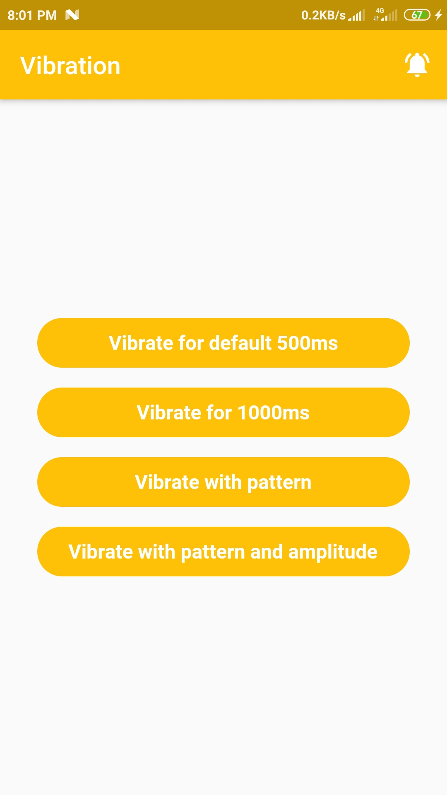
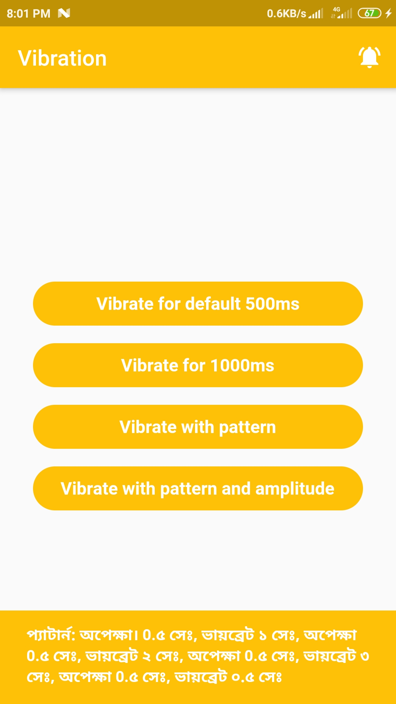

# Vibration Flutter

This project is for learning how to make vibration in Flutter App.

### - Vibration
 
 - [Package Link](https://github.com/benjamindean/flutter_vibration)
 
## Android Permission
 
 The `VIBRATE` permission is required in AndroidManifest.xml.
 
 ``` xml
 <uses-permission android:name="android.permission.VIBRATE"/>
 ```
 
## Screenshots
 &nbsp;&nbsp;&nbsp;&nbsp;&nbsp;&nbsp;&nbsp;&nbsp;&nbsp;&nbsp; 